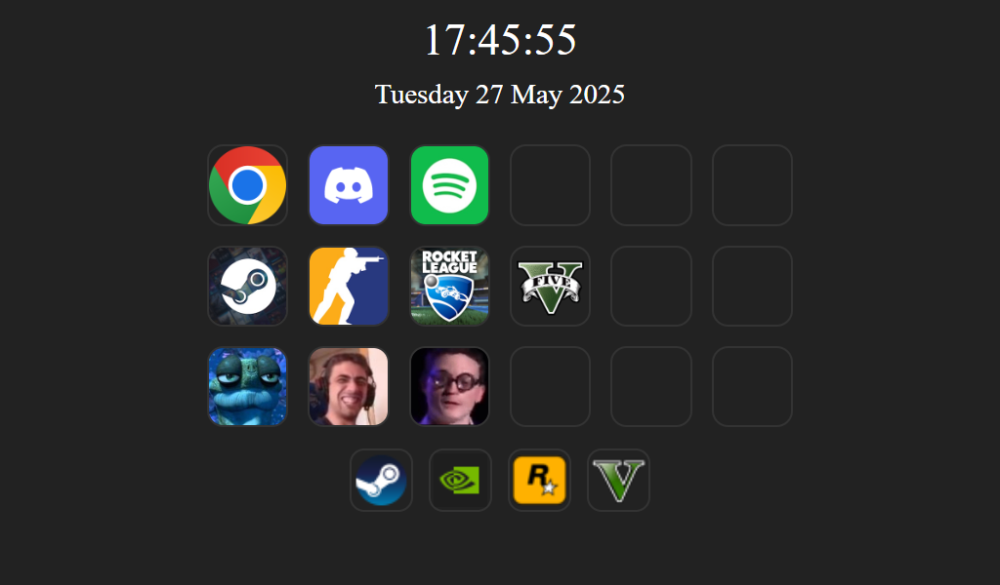

# PC Monitor Dashboard 

## Project Overview

This is a personal project designed specifically for use with my Raspberry Pi connected to a small 1024x600 touchscreen display.  It acts as a dashboard for my gaming PC, kind of like a Stream Deck.

This project sets up a PC monitoring dashboard using:

- **[Open Hardware Monitor](https://openhardwaremonitor.org/news/release-version-0-9-6/)** to collect system stats
- **[Macro Server](https://github.com/Simonkrh/pc-macro-server)** to launch applications, switch accounts with [TcNo Account Switcher](https://github.com/TCNOco/TcNo-Acc-Switcher/releases/tag/2024-08-30_01), and volume control
- **[Spotify Integration](https://developer.spotify.com/documentation/web-api)** to display and control songs and playlists

### Showcase
<div align="center">
  
  
</div>

<div align="center">
  <em>Main dashboard and resource page.</em>
</div>

<br/>

<p align="center">
  <br/>
  <em>Spotify page.</em>
</p>

## Configs
### Config UI (Recommended)
Use the dashboard UI to set up and manage all required settings:
- Open **Settings** → **Config** (or go to `/config`).
- Changes are saved to disk. If the files don't exist yet, they are created on save.
- If you change `SERVER_PC_IP` or `MACRO_PC_IP`, refresh the page to use the new IPs.

### Optional: Edit Files Manually
If you prefer, you can edit the config files directly:
- `.env` in the repo root (backend settings)
- `frontend/config.js` (frontend IPs)
## How to Use 
You don't need all integrations enabled. Each feature works independently:
- Open Hardware Monitor is only needed for the Resources page stats.
- Spotify integration is only needed for the Spotify page.
- Macro Server is only needed for macros and volume control.

1. **Start Open Hardware Monitor** (optional) Launch `OpenHardwareMonitor.exe` on the PC you want to monitor (must match `MONITORED_PC_IP`). Then go to **Options > Remote Web Server > Run** to start the OHM web server (default port `8085`).
2. **Install requirements**: On the dashboard PC, run ```bash pip install -r requirements.txt```
3. **Start the backend server**: On the same PC, run: ```bash python backend/app.py ``` (default port `5000`).
4. **Start the frontend web server**: On the same PC, run: ```bash python frontend/webserver.py ``` 
5. **Start the [Macro Server](https://github.com/Simonkrh/pc-macro-server)** (optional): Required for macro buttons and volume control. Run it on the PC where macros should be triggered.
