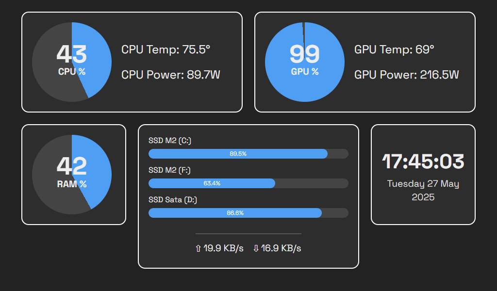

# PC Monitor Dashboard 

## Project Overview

This is a personal project designed specifically for use with my Raspberry Pi connected to a small 1024x600 touchscreen display.  It acts as a dashboard for my gaming PC, kind of like a Stream Deck.

This project sets up a PC monitoring dashboard using:

- **[Open Hardware Monitor](https://openhardwaremonitor.org/news/release-version-0-9-6/)** to collect system stats
- **[Glances](https://github.com/nicolargo/glances/releases/tag/v4.3.0.8)** to collect network stats
- **[Macro Server](https://github.com/Simonkrh/pc-macro-server)** to launch applications, switch accounts with [TcNo Account Switcher](https://github.com/TCNOco/TcNo-Acc-Switcher/releases/tag/2024-08-30_01), and volume control
- **[Spotify Integration](https://developer.spotify.com/documentation/web-api)** to display and control songs and playlists

### Showcase
<div align="center">
  
  
</div>

<div align="center">
  <em>Main dashboard and resource page.</em>
</div>

<br/>

<p align="center">
  <br/>
  <em>Spotify page.</em>
</p>

## Configs
### Set Up the Required .env File
Create a `.env` file in the **root folder** with the following structure:
```
MONITORED_PC_IP=""  # The PC being monitored (OHM & Glances) - in my case, the Gaming PC
SERVER_PC_IP=""      # The PC running the backend server - in my case, the Raspberry Pi

# From "https://developer.spotify.com/"
SPOTIFY_CLIENT_ID="" 
SPOTIFY_CLIENT_SECRET=""
SPOTIFY_REFRESH_TOKEN=""

UPLOAD_FOLDER="" # The folder where images are uploaded to (for slideshow)
```

### Configuring `config.js`
Create a `config.js` file inside the **frontend folder** with the following content:
```js
const CONFIG = {
    SERVER_PC_IP: "" // The PC running the backend server - in my case, the Raspberry Pi
    MACRO_PC_IP: "" // The PC running the macro server - in my case, the Gaming PC
};
```
## How to Use 
1. **Start Open Hardware Monitor** Launch `OpenHardwareMonitor.exe` on the PC you want to monitor (must match `MONITORED_PC_IP`). Then go to **Options > Remote Web Server > Run** to start the OHM web server
2. **Start Glances** On the same monitored PC, run: ```bash glances -w ```
3. **Install requirments**: On the dashboard pc, run ```pip install -r requirements.txt```
4. **Start the backend server**: On the same pc, run: ```bash python backend/app.py ``` 
5. **Start the frontend web server**: On the same pc, run: ```bash python frontend/webserver.py ``` 
6. **Start the [Macro Server](https://github.com/Simonkrh/pc-macro-server)**: This is required for macro buttons and volume control to function. Run it on the PC where macros should be triggered
